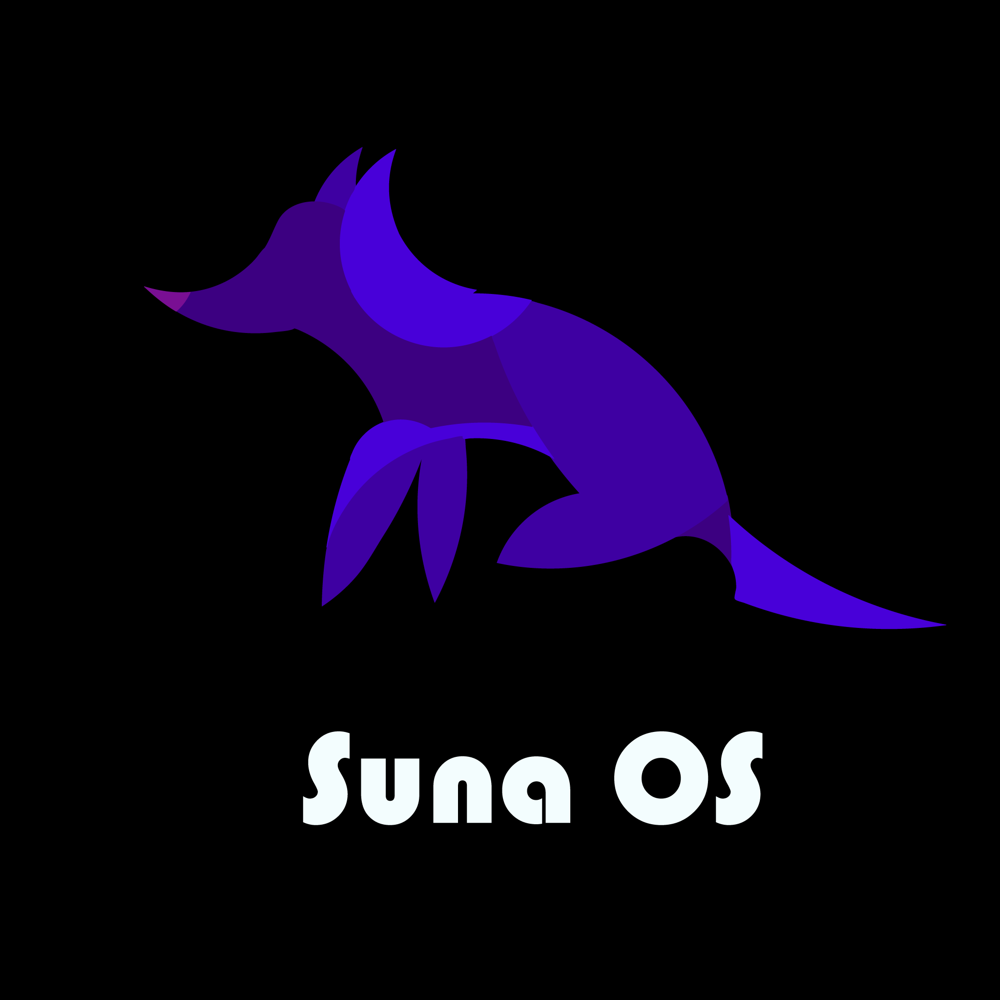

<body>
<h1 align="center">Its Suna Os!</h1>
<h4 align="center" >A Simple Os, Based On Google Search And My Knowledge</h4>

<h2 lign="center">Stuffs I Need ToDo</h2>
- [x] Basic Calculator  
- [ ] Science Calculator  
- [ ] better memory managment  
- [ ] networking  
- [ ] framebuffer  
- [x] basic shell  
- [ ] basic 2d game 
- [ ] basic 3d raycasting game 
- [ ] basic pgm photo support 
- [ ] c libary  
- [x] basic VGA colors  
- [x] basic VGA text  
- [x] basic Keyboard Driver 
- [ ] basic compiler 
- [ ] basic linker 
- [ ] basic assembler 
- [x] basic sounds 
- [x] basic kernel 
- [ ] basic kernel modules                                                                                                                                                      
</body>
